# Synapse AI 洞察引擎 — 产品功能介绍

Synapse 是面向企业级 AI 应用的多模态数据湖与洞察平台，覆盖数据入湖、智能处理、语义探索、训练数据集管理、团队协作与模型优化全链路，帮助团队将分散的多模态数据转化为可训练、可决策的业务洞察。

---

## 1. 平台概览

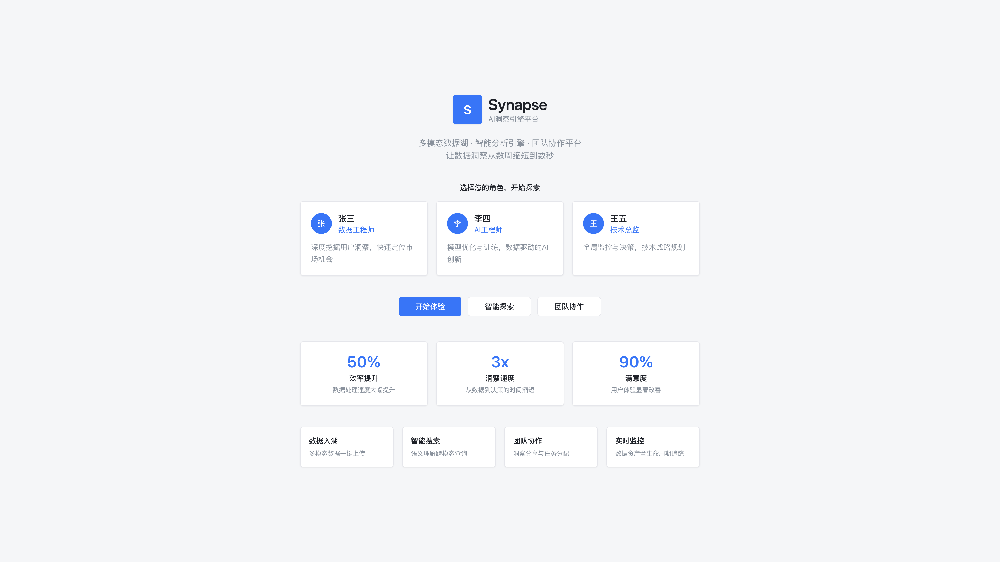

- 统一工作台，串联数据工程、AI 工程与管理决策角色
- 支持多模态数据湖、智能分析引擎与团队协作一体化
- 核心能力：数据入湖、智能探索、团队协作、全生命周期监控

---

## 2. 数据入湖

支持五种数据源接入，入湖后由 AI 自动处理并构建知识图谱。

### 2.1 Web 本地上传

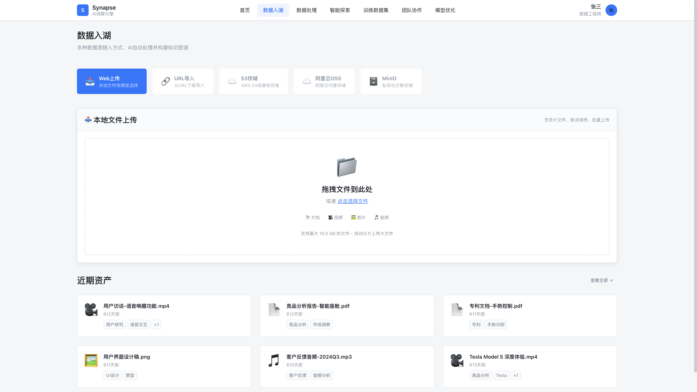

- 拖拽或选择本地文件，支持批量上传
- 覆盖文档、视频、图片、音频等多模态格式
- 大文件自动分片，支持断点续传（单文件最大 10GB）
- 入湖资产自动打标，可在「近期资产」中快速检索

### 2.2 URL 导入

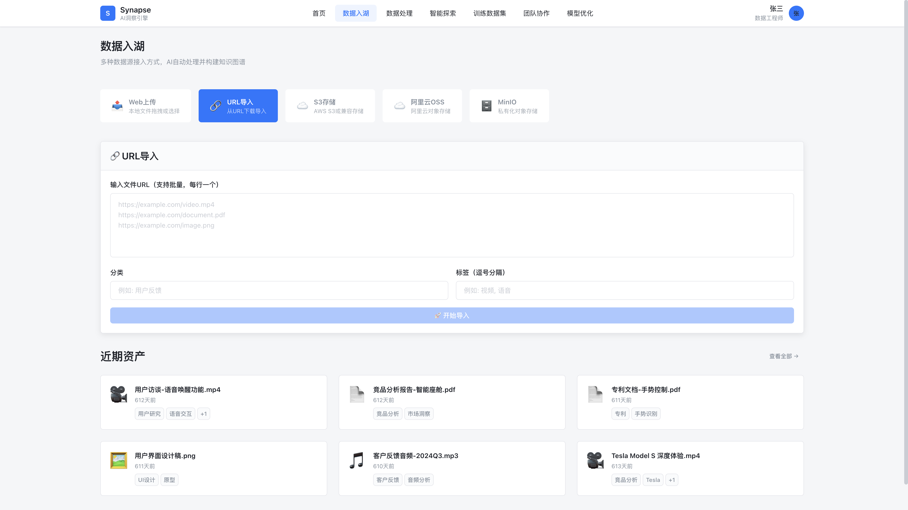

- 支持批量 URL 导入（每行一个链接）
- 可配置分类与标签，便于后续检索与治理
- 适用于外部报告、媒体资源等远程数据汇聚

### 2.3 对象存储集成

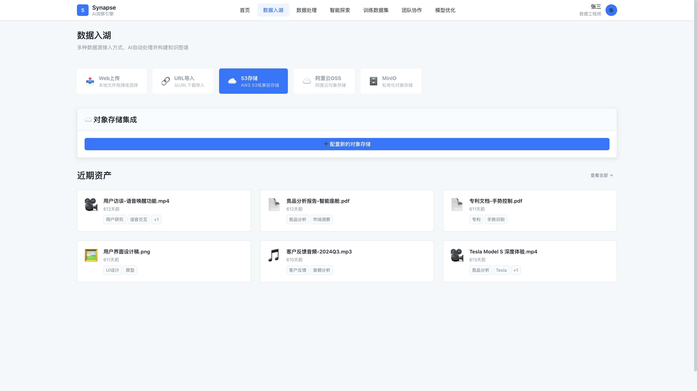

- 支持 AWS S3、阿里云 OSS、MinIO 等对象存储
- 一键配置存储连接，实现云端数据批量同步入湖
- 适合企业已有云存储资产的统一纳管

---

## 3. 数据处理

实时监控 AI 数据处理流水线，完成特征提取、向量化与知识图谱构建。

### 3.1 处理流程监控

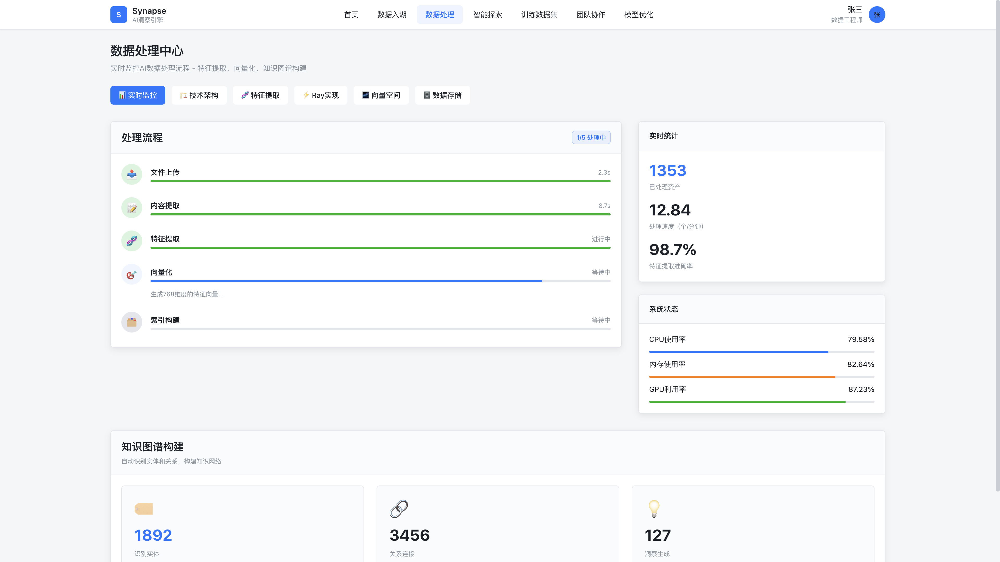

- 可视化五阶段流水线：文件上传 → 内容提取 → 特征提取 → 向量化 → 索引构建
- 实时展示处理进度、速度与特征提取准确率
- 监控 CPU / 内存 / GPU 资源占用
- 自动识别实体与关系，持续构建知识图谱

### 3.2 向量空间可视化

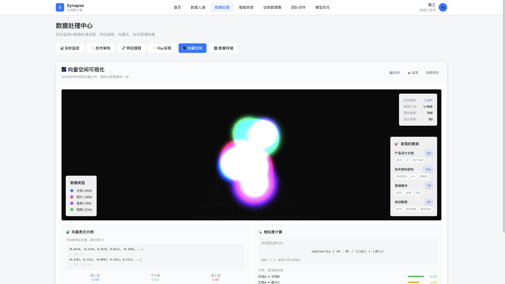

- 768 维特征向量经 t-SNE 降维后的 3D 空间展示
- 相似内容自动聚类（产品设计、技术架构、营销资料等）
- 支持余弦相似度计算，为语义检索与推荐提供基础

---

## 4. 智能探索

基于 AI 语义搜索，跨模态发现数据中的隐藏洞察。

### 4.1 语义搜索

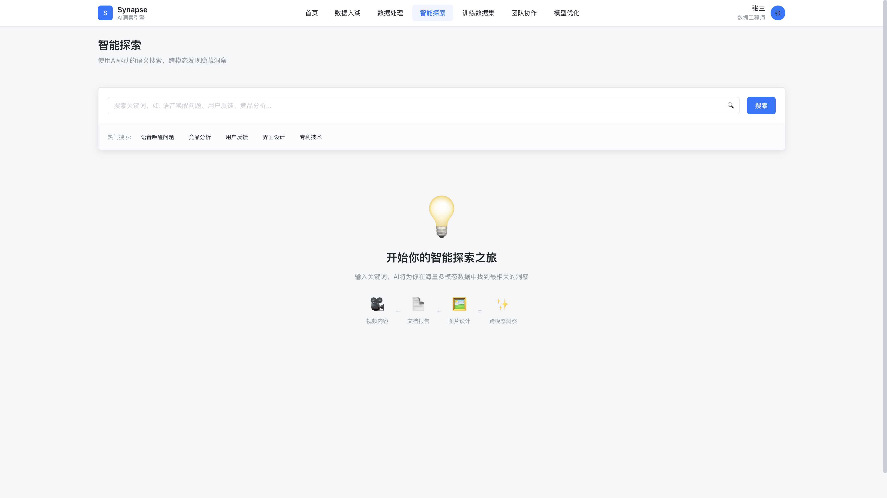

- 自然语言关键词搜索，支持视频、文档、图片跨模态检索
- 提供热门搜索标签，降低使用门槛
- 毫秒级响应，快速定位高价值内容

### 4.2 搜索结果

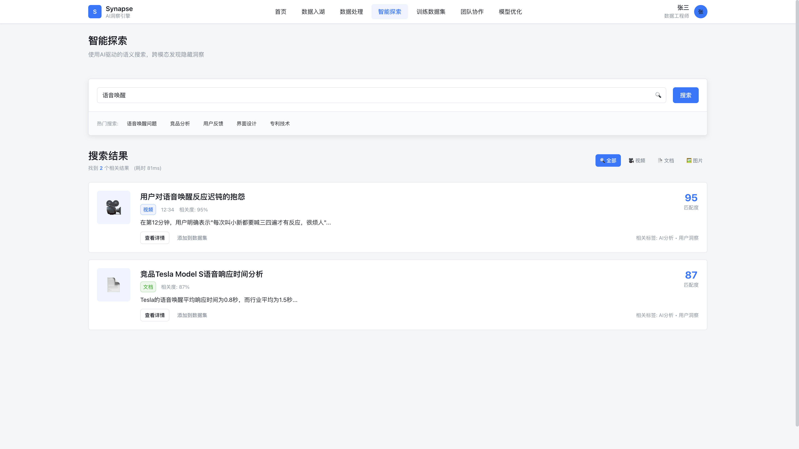

- 按相关度排序，展示匹配片段与时间戳定位
- 支持按类型筛选（全部 / 视频 / 文档 / 图片）
- 一键查看详情或添加到训练数据集

---

## 5. 训练数据集

为 AI 训练平台提供高质量、标准化的数据集，是数据湖的核心价值输出。

### 5.1 数据集管理

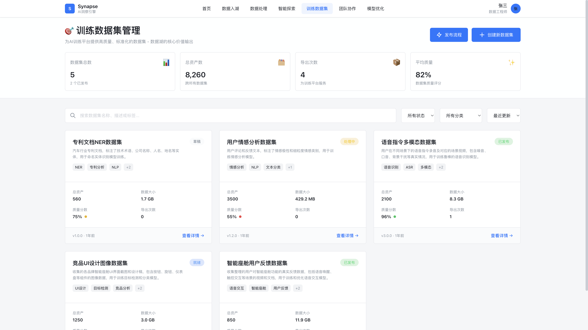

- 统一管理 NLP、CV、语音、多模态等多类型数据集
- 展示资产数量、数据量、质量评分与导出次数
- 支持按状态、分类筛选，以及名称 / 标签搜索
- 覆盖草稿、处理中、就绪、已发布等全生命周期状态

### 5.2 发布流程

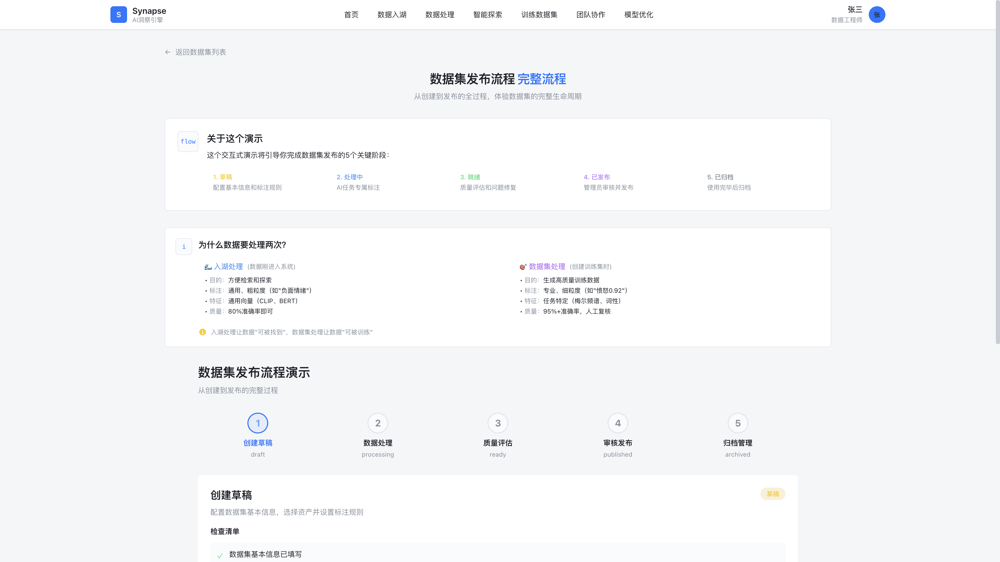

- 五阶段发布：草稿 → 处理中 → 就绪 → 已发布 → 已归档
- **入湖处理**：通用标注，支撑检索与探索（准确率约 80%）
- **数据集处理**：任务专用精细标注，支撑模型训练（准确率 95%+，含人工复核）
- 可视化流程引导，确保交付训练平台的数据质量可控

---

## 6. 团队协作

打通数据工程师与 AI 工程师的跨角色协作链路。

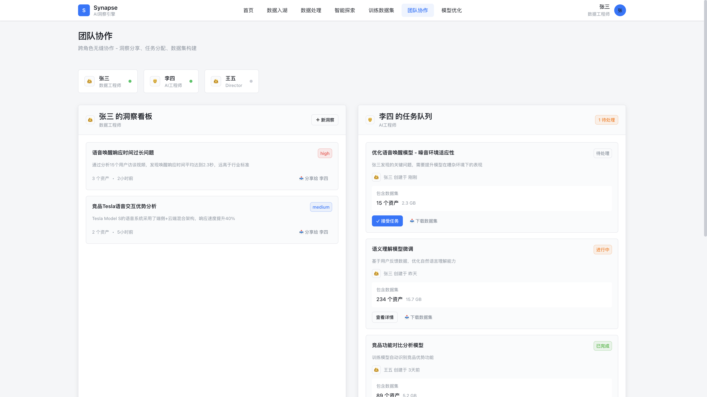

- 团队成员在线状态实时可见
- **洞察看板**：记录分析发现，标注优先级，关联原始资产
- **任务队列**：将洞察转化为可执行任务，支持接受任务与下载数据集
- 任务状态跟踪：待处理 / 进行中 / 已完成

---

## 7. 模型优化

对比分析模型性能，验证优化效果，形成数据到模型的闭环。

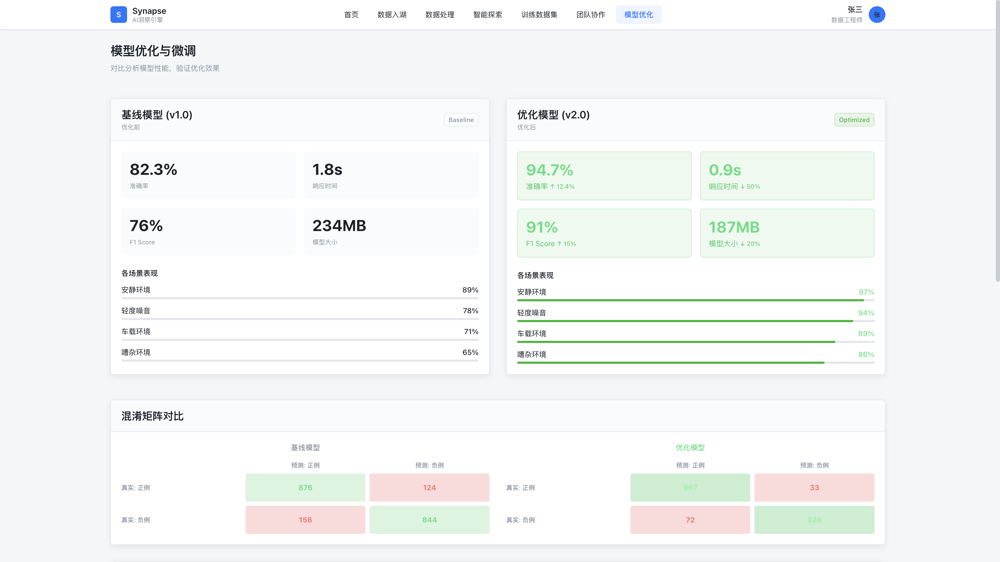

- 基线模型与优化模型并排对比（准确率、响应时间、F1、模型大小）
- 分场景性能分析：安静环境、轻度噪音、车载环境、嘈杂环境
- 混淆矩阵可视化，直观展示分类改进效果
- 支持基于数据集持续迭代微调

---

## 产品能力总览

| 模块 | 核心能力 |
|------|----------|
| 数据入湖 | Web 上传、URL 导入、S3 / OSS / MinIO 对象存储 |
| 数据处理 | 流水线监控、特征提取、向量化、知识图谱、向量可视化 |
| 智能探索 | AI 语义搜索、跨模态检索、相关度排序 |
| 训练数据集 | 全生命周期管理、质量评估、发布与导出 |
| 团队协作 | 洞察分享、任务分配、数据集交付 |
| 模型优化 | 性能对比、场景分析、混淆矩阵评估 |
